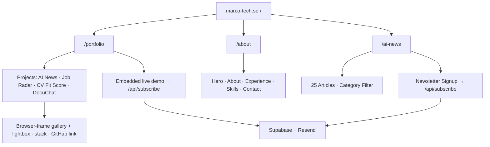
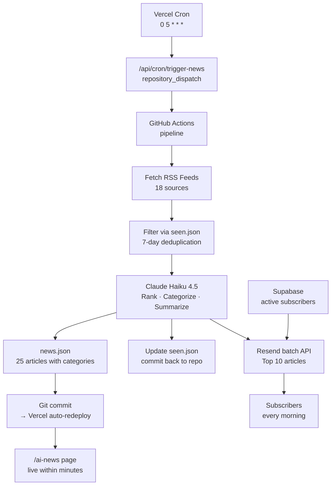
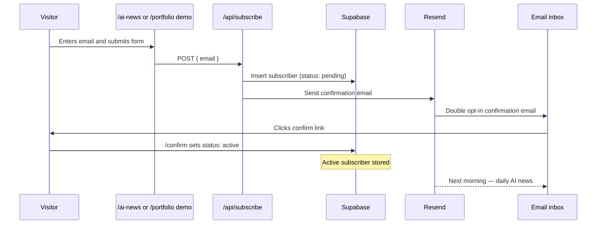

# marco-tech.se

Personal website for Marco Lundh — full-stack Python developer transitioning into AI engineering. The site serves three purposes: a project portfolio, a CV/about page, and a daily AI news newsletter.

**Live:** [marco-tech.se](https://marco-tech.se)

---

## Features

- **Portfolio** — project showcase at `/portfolio`: AI News automation (with an embedded live demo), Job Radar, CV Fit Score, and DocuChat. Each project has a browser-framed screenshot gallery with lightbox, a tech-stack list, and a link to its GitHub repo.
- **About / CV** — profile, experience timeline, skills, and contact at `/about`
- **AI News** — daily curated AI news at `/ai-news` with category filtering and newsletter signup
- **Daily newsletter** — top 10 AI stories delivered by email every morning via Resend
- **Bilingual** — English / Swedish toggle (auto-detected from browser language)

---

## Tech Stack

| Layer | Choice |
|---|---|
| Framework | Next.js 15 (App Router) |
| Language | TypeScript |
| Styling | Tailwind CSS |
| Animations | Framer Motion |
| i18n | Custom React context (EN/SV) |
| Deployment | Vercel |
| Email delivery | Resend |
| Subscriber store | Supabase (Postgres) |
| News pipeline | Python · GitHub Actions · Claude Haiku 4.5 |

---

## Site Structure



---

## Newsletter Pipeline

Runs every morning. Vercel Cron triggers the workflow via `repository_dispatch`
for reliable timing (GitHub's own cron schedule drifts by hours).



### Subscriber Signup Flow



### News Categories

| # | Category |
|---|---|
| 1 | LLMs & Models |
| 2 | AI Agents & Automation |
| 3 | Open Source AI |
| 4 | AI Tools & Frameworks |
| 5 | MLOps & Infrastructure |
| 6 | Research & Papers |
| 7 | AI in Industry |
| 8 | Ethics & Policy |
| 9 | Generative Media |
| 10 | Funding & Business |

### RSS Sources

**AI Labs:** Anthropic · OpenAI · Google DeepMind · Meta AI · Microsoft AI · NVIDIA · AWS Machine Learning · Apple ML Research · Mistral AI · Cohere · xAI · Hugging Face

**Journalism:** MIT Technology Review AI · Ars Technica AI · The Verge AI · VentureBeat AI

**Community:** Simon Willison · The Batch (DeepLearning.AI)

---

## Local Development

```bash
npm install
npm run dev
```

Open [http://localhost:3000](http://localhost:3000).

---

## Environment Variables

| Variable | Where | Purpose |
|---|---|---|
| `ANTHROPIC_API_KEY` | GitHub Actions Secret | Claude Haiku for news curation |
| `RESEND_API_KEY` | GitHub Actions Secret + Vercel | Sending confirmation + newsletter emails |
| `SUPABASE_URL` | GitHub Actions Secret + Vercel | Subscriber database endpoint |
| `SUPABASE_SERVICE_KEY` | GitHub Actions Secret + Vercel | Server-side database access (service role) |
| `CRON_SECRET` | Vercel | Vercel Cron sends this as a Bearer token; the cron route verifies it |
| `GITHUB_DISPATCH_TOKEN` | Vercel | PAT used by the cron route to fire the pipeline via `repository_dispatch` |

Never commit secrets to the repository. Add them via:
- **GitHub:** Settings → Secrets and variables → Actions
- **Vercel:** Project → Settings → Environment Variables

The `SUPABASE_SERVICE_KEY` bypasses Row Level Security — it is used only
server-side (API routes and the pipeline) and is never exposed to the browser.

### Database schema

The `subscribers` table in Supabase:

```sql
create table subscribers (
  id uuid primary key default gen_random_uuid(),
  email text unique not null,
  status text not null default 'pending',  -- pending | active | unsubscribed
  confirm_token text not null,
  unsubscribe_token text not null,
  created_at timestamptz default now(),
  confirmed_at timestamptz,
  confirmation_sent_at timestamptz  -- throttles repeat confirmation emails
);
```

---

## Project Structure

```
marcolundh/
├── app/
│   ├── layout.tsx
│   ├── page.tsx                 # Home — Portfolio + About me cards
│   ├── portfolio/
│   │   ├── page.tsx             # Portfolio — project showcase
│   │   ├── ProjectsNav.tsx      # Portfolio nav (About · AI News · home)
│   │   └── ProjectShowcase.tsx  # Project rows: gallery + lightbox + live demo
│   ├── about/page.tsx           # About / CV (Hero · About · Experience · Skills · Contact)
│   ├── ai-news/
│   │   ├── page.tsx             # AI News feed
│   │   ├── AiNewsNav.tsx
│   │   ├── ArticleList.tsx
│   │   └── SubscribeForm.tsx    # Signup form (reused as `compact` live demo on /portfolio)
│   ├── confirm/page.tsx         # Double opt-in confirmation
│   ├── unsubscribe/page.tsx     # Unsubscribe landing
│   └── api/
│       ├── subscribe/route.ts   # Newsletter signup endpoint
│       ├── unsubscribe/route.ts # One-click unsubscribe (List-Unsubscribe)
│       └── cron/trigger-news/   # Vercel Cron → repository_dispatch
├── components/                  # CV/about + shared components
│   ├── Nav.tsx
│   ├── StatusCard.tsx           # Confirm / unsubscribe result UI
│   ├── UnsubscribeButton.tsx
│   ├── Hero.tsx
│   ├── About.tsx
│   ├── Experience.tsx
│   ├── Skills.tsx
│   └── Contact.tsx
├── contexts/
│   └── LanguageContext.tsx
├── lib/
│   ├── translations.ts          # EN/SV strings incl. projects.items
│   ├── supabase.ts              # Server-side Supabase client
│   └── email.ts                 # Resend client + confirmation email
├── public/projects/             # Project screenshots (one folder per slug)
│   ├── job-radar/               # 1.png … 9.png
│   ├── cv-fit-score/            # 1.png … 4.png
│   └── docuchat/                # 1.png
├── pipeline/
│   ├── curate.py                # Main pipeline script
│   ├── seen.json                # Deduplication state
│   └── news-config.json         # Sources and topics config
├── app/data/
│   └── news.json                # Daily output (overwritten daily)
└── .github/workflows/
    └── daily-news.yml           # Cron job definition
```

---

## Deployment

The site deploys automatically to Vercel on every push to `main`. The news pipeline commits `news.json` back to the repo daily, which triggers a Vercel redeploy — no manual steps needed.
